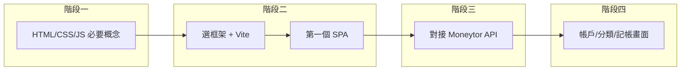

# 後端工程師前端學習規劃

您目前的 Moneytor 是 **純 API 後端**（Go + Gin + PostgreSQL），端點都在 `/api/v1`（health、accounts、categories、transaction-types、entries、currencies）。下面是一條「邊學邊做」的路線，用您的 API 當練習對象，從基礎到能做出可用的記帳前端。

---

## 手機也能用的 App：建議形式

希望 **在手機也能用** 時，建議採用以下形式，同一套前端程式即可兼顧電腦與手機：

| 形式 | 說明 | 建議 |
|------|------|------|
| **Responsive Web App（響應式網頁）** | 同一個 SPA，用 CSS 媒體查詢與彈性排版（Flexbox/Grid）讓版面在手機、平板、桌機都能正常顯示；在手機瀏覽器開網址即可使用。 | **優先做法**：從一開始就當成 RWD 來做（viewport、觸控友善按鈕大小、不依賴 hover）。 |
| **PWA（Progressive Web App）** | 在響應式網頁基礎上加上 **Web App Manifest**（名稱、圖示、全螢幕等）與 **Service Worker**（可選：離線快取）；使用者可「加到主畫面」，像 App 一樣從圖示開啟。 | **進階**：前端穩定後再加，不需改後端。 |
| **用 Capacitor 打包成商店 App** | 把同一套網頁用 [Capacitor](https://capacitorjs.com/) 包成 iOS/Android 原生殼，可上架 App Store / Google Play；仍是同一套 React/Vue 程式。 | **若未來要上架商店**再考慮；學習階段先做 RWD 即可。 |

**結論**：前端以 **「響應式網頁（RWD）+ 之後可選 PWA 或 Capacitor」** 的形式開發即可，不需為手機另寫一套原生 App。實作時注意：

- 在 HTML 加 `<meta name="viewport" content="width=device-width, initial-scale=1">`。
- 按鈕、連結至少約 44×44px，方便手指點擊。
- 排版用 Flexbox/Grid、避免固定寬度，必要時用 `@media` 調整字級與間距。
- 若有導覽列，手機版可改為漢堡選單或底部 Tab。

---

## 學習路線總覽

- **原則**：每個階段都搭配「小目標」或「在 Moneytor 上的具體功能」，避免只上課不寫碼。
- **預估**：若每週能投入約 5–10 小時，約 2–3 個月可完成到「能自己加新頁面、接 API」的程度；時間可依自己步調拉長或縮短。

---

## 階段一：Web 與 JavaScript 必要概念（約 2–3 週）

目標：能看懂瀏覽器裡的「結構、樣式、行為」是怎麼分工的，並會用 JS 操作畫面與發請求。

### 1.1 HTML / CSS

- **HTML**：文件結構、常用標籤（`div`、`span`、`form`、`input`、`button`、`table`、`ul/ol`）、語意化（`header`、`main`、`section`）。
- **CSS**：選擇器、盒模型、`display`（block / inline / flex）、簡單的 Flexbox 排版、`class` 命名習慣（可先 BEM 或簡單前綴即可）。
- **練習**：用一個靜態 HTML 頁面做出「帳戶列表」的假資料表格 + 簡單表單（帳戶名稱、幣別），不接 API，只練結構與排版。

### 1.2 JavaScript（瀏覽器端）

- **必會**：變數、條件、迴圈、函式、陣列與物件、`console.log` 除錯。
- **DOM**：`document.querySelector`、`getElementById`、改 `textContent` / `innerHTML`、監聽 `addEventListener`（click、submit）。
- **非同步**：`Promise`、`async/await`、`fetch(url)` 發 HTTP 請求並解析 JSON。
- **練習**：在同一個靜態頁面裡，用 `fetch('http://localhost:您的埠/api/v1/accounts')` 取得資料並用 JS 動態把表格填滿；若 CORS 擋住，可先在 Gin 暫時加 CORS middleware，或先用瀏覽器擴充暫時關 CORS 驗證概念即可。

**小結**：階段一結束時，您應該能寫出「一個 HTML 頁 + CSS + JS」，用 `fetch` 呼叫 Moneytor 的 `GET /api/v1/accounts` 並把結果顯示在畫面上。

---

## 階段二：選框架 + 開發環境（約 2–3 週）

目標：從「單一 HTML 手動改 DOM」升級成「元件化 + 建置工具」，方便之後加頁面、接更多 API。

### 2.1 框架選擇（二選一即可）

| 面向     | React                         | Vue               |
|----------|-------------------------------|-------------------|
| 學習曲線 | 概念較多（JSX、state、hooks） | 模板語法較接近 HTML，較易上手 |
| 生態與職缺 | 較多                          | 也不少，亞洲尤其多 |
| 與您專案搭配 | 可直接用 `fetch` 或 axios 接 Go API | 同上 |

- **若希望「最快能做出可用的頁面」**：可先選 **Vue 3**（Composition API + `<script setup>`），模板和您熟悉的「後端模板」較像。
- **若以「職涯或長期生態」為重**：可選 **React**，之後要學 Next 等也順。

兩者都能完美對接您現有的 REST API，差別主要在語法與心智模型。

### 2.2 開發環境

- 使用 **Vite** 建立專案（`npm create vite@latest`），選 Vue 或 React 即可。
- 建議把前端專案放在 Moneytor 目錄下，例如 `web/` 或 `frontend/`，與 Go 後端分開，之後可同一 repo 一起管理。
- 熟悉：`npm run dev`（開發伺服器）、`npm run build`（產出靜態檔）、如何把 `build` 產物給 Go 靜態檔服務（若要做成單一部署）。

### 2.3 第一個 SPA 目標

- 用 Vite + 您選的框架做出「單頁」：一個表單（例如帳戶名稱 + 幣別）、一個列表。
- 表單送出時用 `POST /api/v1/accounts` 建立帳戶，列表用 `GET /api/v1/accounts` 取得並顯示。
- 先不考慮路由（不一定要 Vue Router / React Router），一個頁面即可；重點是「元件 + 狀態 + 呼叫 API」。

**小結**：階段二結束時，您會有一個跑在 Vite 上的小 SPA，能對 Moneytor 的 accounts 做「列表 + 新增」。

---

## 階段三：與 Moneytor API 完整對接（約 1–2 週）

目標：穩健地呼叫現有所有端點，並處理載入中、錯誤、列表分頁。

### 3.1 後端需配合的事（您已有或可加）

- **CORS**：在 Gin 加上 CORS middleware，允許前端開發伺服器（例如 `http://localhost:5173`）來源；否則瀏覽器會擋住 `fetch`。
- **API 基底網址**：前端用環境變數或設定檔（如 Vite 的 `import.meta.env`）設定 `baseURL`，方便開發與正式環境切換。

### 3.2 前端要會的事

- 用 **fetch** 或 **axios** 封裝：`getAccounts()`、`createAccount()`、`getCategories()`、`createEntry()` 等，對應 `api/server.go` 的 routes。
- 統一處理：loading 狀態、錯誤訊息（例如顯示 `errResponse` 的 `error` 欄位，或之後後端改成通用訊息後的對應欄位）。
- 若採用 **GET /api/v1/accounts** 的分頁（`pageId`、`pageSize`），在前端加上「下一頁 / 上一頁」或「載入更多」。

**小結**：階段三結束時，前端已能穩定呼叫 Moneytor 的 health、accounts、categories、transaction-types、entries、currencies，並在畫面上顯示載入/錯誤。

---

## 階段四：在 Moneytor 上實作功能順序（約 2–4 週）

用「由簡到繁」的方式，把 API 變成可見可用的介面：

1. **帳戶**：列表（含分頁）、新增帳戶表單；可選：簡單的「餘額」顯示。
2. **分類與交易類型**：下拉選單或列表，資料來自 `GET /api/v1/categories` 與 `GET /api/v1/transaction-types`。
3. **幣別**：新增帳戶時用 `GET /api/v1/currencies` 做幣別下拉。
4. **記帳（entries）**：表單欄位對應 `POST /api/v1/entries`（name、note、from_account_id、to_account_id、category_id、amount 等），送出後可選擇重新取得列表或導向列表頁；列表用 `GET /api/v1/entries`（若有分頁再同上處理）。

可選進階：簡單路由（例如 `/accounts`、`/entries`）、表單驗證（必填、數字格式）、基本錯誤邊界或 toast 提示。**手機版**：導覽改為底部 Tab 或漢堡選單，列表與表單在小螢幕上可讀、可點。

---

## 推薦學習資源（免費為主）

- **MDN（MDN Web Docs）**：查 HTML / CSS / JavaScript 與 Web API（fetch、DOM）的權威參考。
- **JavaScript 入門**：MDN 的「JavaScript 指南」或 [javascript.info](https://javascript.info)（英文，結構清楚）。
- **Flexbox / 排版**：MDN 或 [Flexbox Froggy](https://flexboxfroggy.com/) 小遊戲。
- **Vue 3**：官方文件 [vuejs.org](https://vuejs.org) 的「介紹」與「Composition API」；可搭配 [Vue Mastery](https://www.vuemastery.com) 免費入門課程。
- **React**：官方 [react.dev](https://react.dev) 的「Learn React」；可搭配 [Scrimba](https://scrimba.com) 的免費 React 課程。
- **Vite**：官方 [vitejs.dev](https://vitejs.dev) 文件即可。
- **RWD / 手機版**：MDN「Responsive design」、[web.dev 的 PWA](https://web.dev/progressive-web-apps/)。

---

## 與您專案的對應關係

| 您學到的                   | 在 Moneytor 的對應                 |
|---------------------------|------------------------------------|
| HTML 結構 + 表單          | 帳戶 / 記帳 表單、列表表格         |
| CSS 排版 + RWD            | 列表、按鈕、手機/桌機皆可用的版面  |
| JS fetch + async/await    | 呼叫 `/api/v1/*` 各端點            |
| 框架元件 + 狀態           | 帳戶列表元件、記帳表單元件、loading/error 狀態 |
| 建置與部署                | Vite build → 可交給 Go 靜態檔或獨立部署 |
| 手機也能用                | 響應式版面 + 觸控友善；可選 PWA 或 Capacitor 打包 |

---

## 建議的下一步（不寫碼，只規劃）

1. **決定框架**：Vue 或 React 選一個，先不混用。
2. **排一週計畫**：例如「本週只看 MDN HTML/CSS + 做一個靜態帳戶列表假資料頁」。
3. **在 Gin 加 CORS**：當您準備用 `fetch` 呼叫本機 API 時再實作即可，計畫時可先記在待辦。
4. **從一開始就當 RWD 做**：加 viewport、按鈕不要太小，之後在手機瀏覽器開同一網址就能用。

若您願意，我可以再幫您把「在 Moneytor 加 CORS」或「用 Vite 建立 `web/` 並接 GET /api/v1/accounts」拆成具體的實作步驟（含要改的檔案與程式碼位置），方便您按步驟做。
